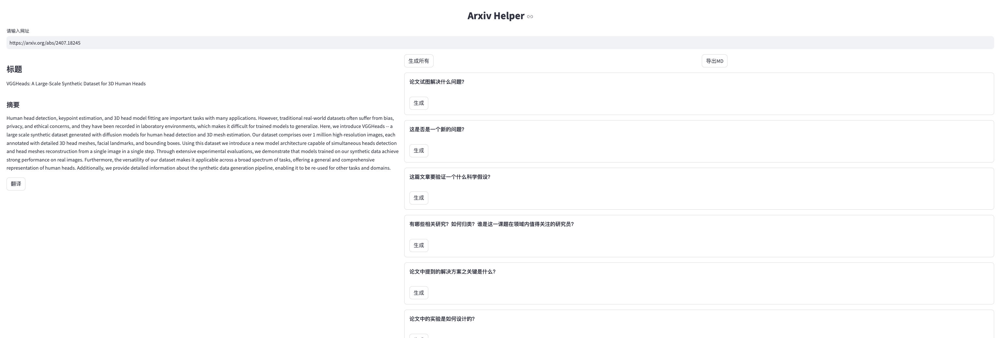
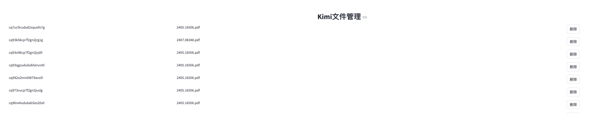

# Paper-Agent

一款可以帮助经常阅读论文的同学提升效率的小工具，有两个部分：
- HuggingFace Weekly Paper 制作工具
- Arxiv Helper

## 前置条件
翻译基于 `deepseek` 的服务， 论文十问依赖于 `kimi`， 因此需要这两个的 api key。可以配置到环境变量中，代码中使用的环境变量 key 分别是
- DEEPSEEK_KEY
- KIMI_KEY

如果不想同时用两家，翻译可以考虑也换成 kimi，需要手动修改代码，将 deepseek 里面的设置换成 kimi的。

## 1. HuggingFace Weekly Paper 制作工具
我每周博客和公众号上都会发一篇 weekly paper，文章来源于 HuggingFace 的 Daily Paper。 为了减少每次都要一个个点进去通过N次复制粘贴来得到翻译后的结果的痛苦，写了个脚本，可以直接读取本周的点赞超过n次的论文，并生成Weekly Paper。

代码就是hf.py文件，运行 `weekly_paper` 方法即可，慢慢等待即可，如果出现了一些翻译上的问题或者接口异常，可以重新从目录下的output.md文件里面拿到英文原版继续人工处理。

此脚本依赖的模型是 `deepseek`。 翻译 prompt 来自于微博上宝玉老师的分享。

## 2. Arxiv Helper (0.0.2版本做了大幅度的调整，不再默认使用kimi)

这个使用 `streamlit` 做了前端，输入框里面输入 arxiv 论文的首页地址，回车即可得到它的标题和摘要。

0.0.1版本用的是网页爬虫，0.0.2版本用的arxiv api，速度似乎比爬虫慢一点，但应该更稳定些。

左侧可以进行翻译，右侧是[论文十问](http://leafw.cn/2023/12/25/%e5%88%86%e4%ba%ab%e4%b8%a4%e4%b8%aa%e9%98%85%e8%af%bb%e8%ae%ba%e6%96%87%e7%9a%84%e6%96%b9%e6%b3%95/)的模板，使用初始化的模型的接口进行问答。

论文十问以及系统prompt的配置均在`prompt_template.py` 中，需要的可以自行修改。



新增加了生成所有和导出MD的按钮，方便一次性处理所有问题。

使用了pymupdf抽取了pdf内的内容，不再依赖于kimi的文件管理，主要是kimi的api相对贵了点。



### 支持deepseek（可自己修改其他模型）、kimi以及本地使用ollama部署的模型

``` python
current_llm = KimiLlm() if use_kimi else OllamaLlm('qwen') if use_ollama else OpenAiLlm('deepseek')
```

- 只要是支持OpenAI的模型，均可以使用OpenAiLlm的实现，在config里面配置对应的model_name,api_key以及base_url即可。
- Kimi 因为有自己的文件管理接口，因此使用了单独的实现类,也只有使用kimi的情况下才可以使用设置页面
- Ollama的base_url就是ollama服务的地址

使用方式：

``` shell
streamlit run main.py
```

## 3. 使用flow.py 一键生成功能2里面需要的Markdown文档。
flow.py 就是将2里面的所有功能顺序的放到了一起，修改里面的url即可等待生成需要的论文标题摘要以及对应的QA。

由于Streamlit的限制感觉还是太多了，想要做个更成熟的web产品还是得用正经的前端，包括后端可能也要用自己的主业Java，后续会开发一套成熟一点的Java编写的Web平台。


## 0811 update
新增聊天功能，在主要生成的问题可以直接带到聊天页面，切换菜单的时候自动带上。注意暂时只支持Deepseek