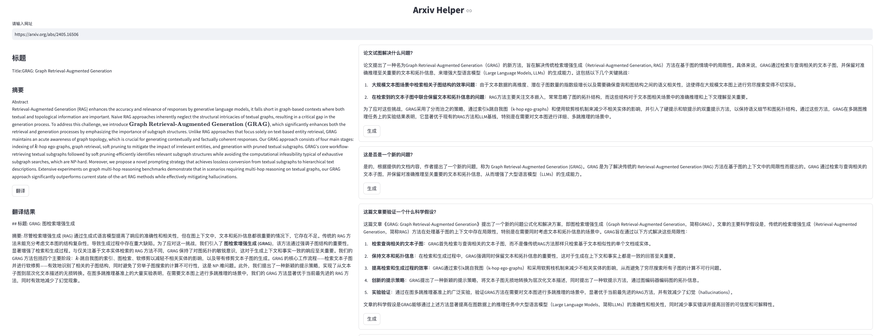

# Paper-Agent

一款可以帮助经常阅读论文的同学提升效率的小工具，有两个部分：
- HuggingFace Weekly Paper 制作工具
- Arxiv Helper

## 前置条件
翻译基于 `deepseek` 的服务， 论文十问依赖于 `kimi`， 因此需要这两个的 api key。可以配置到环境变量中，代码中使用的环境变量 key 分别是
- DEEPSEEK_KEY
- KIMI_KEY

如果不想同时用两家，翻译可以考虑也换成 kimi，需要手动修改代码，将 deepseek 里面的设置换成 kimi的。

## 1. HuggingFace Weekly Paper 制作工具
我每周博客和公众号上都会发一篇 weekly paper，文章来源于 HuggingFace 的 Daily Paper。 为了减少每次都要一个个点进去通过N次复制粘贴来得到翻译后的结果的痛苦，写了个脚本，可以直接读取本周的点赞超过n次的论文，并生成Weekly Paper。

代码就是hf.py文件，运行 `weekly_paper` 方法即可，慢慢等待即可，如果出现了一些翻译上的问题或者接口异常，可以重新从目录下的output.md文件里面拿到英文原版继续人工处理。

此脚本依赖的模型是 `deepseek`.

## 2. Arxiv Helper

这个使用 `streamlit` 做了前端，输入框里面输入 arxiv 论文的首页地址，回车即可得到它的标题和摘要，左侧可以进行翻译，右侧是论文十问的模板，使用 `kimi` 的接口进行问答。



对pdf的读写是依赖于kimi的基于文件的问答，因此会上传文件到kimi，文件上传列表可以在设置页面看到（初版暂时没做文件上传去重处理），不需要的可以删除。文件本身也会下载到data目录，每篇论文对应一个文件夹，里面存放pdf以及数据json，避免每次都要重新调用接口。


使用方式：

``` shell
streamlit run arxiv.py
```

## 后续计划
1. arxiv helper 支持跳转到 kimi 聊天，并带上已经进行过的论文十问;
2. 论文上传去重
3. 本地论文管理（待定）
